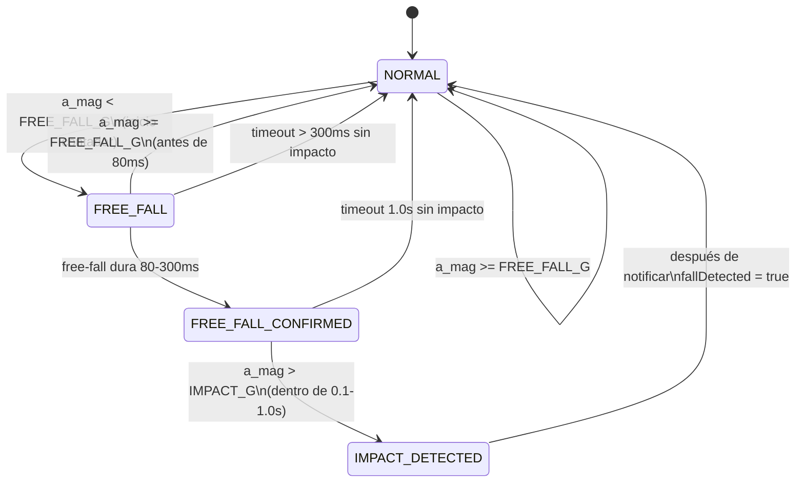

# Máquina de Estados para Detección de Caídas

## Diagrama de la Máquina de Estados



## Cambios en [mpu6050.h](include/mpu6050.h)

Agregar nuevo enum para estados de la FSM y estructura para el contexto:

```cpp
// Estados de la máquina de detección de caídas
enum FallDetectionState {
  STATE_NORMAL = 0,           // Estado A - Esperando free-fall
  STATE_FREE_FALL,            // Detectando duración de free-fall
  STATE_FREE_FALL_CONFIRMED,  // Estado B - Ventana para impacto
  STATE_IMPACT_DETECTED       // Estado C - Caída confirmada
};

// Contexto para la máquina de estados
struct FallDetectionContext {
  FallDetectionState state;
  unsigned long freeFallStartTime;    // Cuando empezó el free-fall
  unsigned long freeFallConfirmedTime; // Cuando se confirmó free-fall (80-300ms)
};
```

Agregar función para inicializar y procesar la FSM:

```cpp
void initFallDetection(FallDetectionContext* ctx);
bool processFallDetection(MPU6050Data* data, FallDetectionContext* ctx, FallInfo* info);
```

## Cambios en [mpu6050.cpp](src/modules/mpu6050.cpp)

### Nuevas constantes temporales

```cpp
#define FREE_FALL_MIN_DURATION_MS  80    // Mínimo tiempo en free-fall
#define FREE_FALL_MAX_DURATION_MS  300   // Máximo tiempo en free-fall
#define IMPACT_WINDOW_MIN_MS       100   // Ventana mínima para impacto (0.1s)
#define IMPACT_WINDOW_MAX_MS       1000  // Ventana máxima para impacto (1.0s)
```

### Nueva función `processFallDetection`

Implementar la lógica de la máquina de estados:

1. **STATE_NORMAL**: Si `a_mag < FREE_FALL_THRESHOLD`, iniciar contador y pasar a `STATE_FREE_FALL`
2. **STATE_FREE_FALL**:

- Si vuelve `a_mag >= FREE_FALL_THRESHOLD` antes de 80ms -> volver a NORMAL
- Si se mantiene 80-300ms -> pasar a `STATE_FREE_FALL_CONFIRMED`

1. **STATE_FREE_FALL_CONFIRMED**:

- Si `a_mag > IMPACT_THRESHOLD` dentro de ventana 0.1-1.0s -> pasar a `STATE_IMPACT_DETECTED`
- Si pasa >1.0s sin impacto -> volver a NORMAL (falso positivo)

1. **STATE_IMPACT_DETECTED**: Retornar `true`, establecer info, volver a NORMAL

## Cambios en [main.cpp](src/main.cpp)

### En `fallDetectionTask`

Crear instancia del contexto e inicializarla:

```cpp
FallDetectionContext fallCtx;
initFallDetection(&fallCtx);
```

Reemplazar llamada a `detectFallsWithInfo` por `processFallDetection`:

```cpp
if (processFallDetection(&data, &fallCtx, &info)) {
  fallDetected = true;
  // ... logging existente ...
}
```

## Comportamiento Esperado

| Escenario                         | Resultado                  |
| --------------------------------- | -------------------------- |
| Free-fall momentáneo (<80ms)      | No detecta caída           |
| Impacto sin free-fall previa      | No detecta caída           |
| Free-fall 100ms + impacto en 0.5s | Caída detectada            |
| Free-fall 150ms + sin impacto     | No detecta caída (timeout) |
